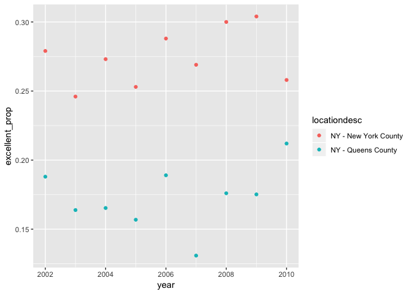

P8105\_hw2
================
Jingwei Ren
10/2/2018

``` r
library(tidyverse)
```

    ## ── Attaching packages ─────────────────────────────────────────────────────────── tidyverse 1.2.1 ──

    ## ✔ ggplot2 3.0.0     ✔ purrr   0.2.5
    ## ✔ tibble  1.4.2     ✔ dplyr   0.7.6
    ## ✔ tidyr   0.8.1     ✔ stringr 1.3.1
    ## ✔ readr   1.1.1     ✔ forcats 0.3.0

    ## ── Conflicts ────────────────────────────────────────────────────────────── tidyverse_conflicts() ──
    ## ✖ dplyr::filter() masks stats::filter()
    ## ✖ dplyr::lag()    masks stats::lag()

``` r
library(readxl)
```

problem 1
=========

-   Read and clean the data; retain line, station, name, station latitude / longitude, routes served, entry, vending, entrance type, and ADA compliance. Convert the entry variable from character (YES vs NO) to a logical variable (the ifelse or recode function may be useful).

``` r
train_data = 
  read_csv(file = "./data/NYC_Transit_Subway_Entrance_And_Exit_Data.csv") %>%
  janitor::clean_names() %>%
  select(line:entry, vending, ada) %>% 
  mutate(entry = recode(entry, `YES` = "TRUE", `NO` = "FALSE")) %>%
  mutate(entry = as.logical(entry))
```

-   Write a short paragraph about this dataset – explain briefly what variables the dataset contains, describe your data cleaning steps so far, and give the dimension (rows x columns) of the resulting dataset. Are these data tidy?

The dataset contain variables include:

1.line

2.station name

3.station latitiude

4.station longitude

5.routes serveed

6.entrance type

7.entry indicating whether the station has entry or not

8.vending showing whether the station has vending system

9.ada compliance

Cleaning steps:

I imported the data, and cleaned the column names by the function clean\_names in the janitor. Couple variables are selected from the orign dataset and the entry variable is converted to a logical factor.

The dimension of the resulting dataset is 1868 rows by 19 columns. The data is not tidy.

-   Answer the following questions using these data:

``` r
newtrain_data = distinct(train_data, station_name, line, .keep_all = TRUE)
```

How many distinct stations are there? Note that stations are identified both by name and by line (e.g. 125th St A/B/C/D; 125st 1; 125st 4/5); the distinct function may be useful here.

There are 465 distinct stations

How many stations are ADA compliant?

84 stations are ADA compliant.

What proportion of station entrances / exits without vending allow entrance?

``` r
entrytrue = train_data %>%  
  filter(vending == "NO") %>% 
  filter(entry == "TRUE") %>%
nrow

vendyno = train_data %>%  
  filter(vending == "NO") %>%
  nrow
```

37.7% of station entrances / exits without vending allow entrance.

Reformat data so that route number and route name are distinct variables. How many distinct stations serve the A train? Of the stations that serve the A train, how many are ADA compliant?

``` r
reformat_data = train_data %>%
  gather(key = route_number, value = route_name,route1:route11) 
  
trainA = reformat_data %>%
  filter(route_name == "A")

adatrue = reformat_data %>%
  filter(route_name == "A") %>%
  filter(ada == "TRUE")
```

60 distinct stations serve the A train.

17 distinct stations that serve the A train and are ADA compliant.

problem2
========

-   Read and clean the Mr. Trash Wheel sheet:

specify the sheet in the Excel file and to omit columns containing notes (using the range argument and cell\_cols() function)

use reasonable variable names

omit rows that do not include dumpster-specific data

rounds the number of sports balls to the nearest integer and converts the result to an integer variable (using as.integer)

``` r
trash_wheel = 
  read_excel('data/HealthyHarborWaterWheelTotals2018-7-28.xlsx', sheet = "Mr. Trash Wheel", range = cell_cols("A:N")) %>% 
  janitor::clean_names() %>% 
  filter(!is.na(dumpster)) %>% 
  mutate(sports_balls = as.integer(round(sports_balls)))

year = trash_wheel %>% 
  filter(year == 2016)
```

-   Read and clean precipitation data for 2016 and 2017. For each, omit rows without precipitation data and add a variable year. Next, combine datasets and convert month to a character variable (the variable month.name is built into R and should be useful).

``` r
precipitation_2016 = 
  read_excel('data/HealthyHarborWaterWheelTotals2018-7-28.xlsx', sheet = '2016 Precipitation', range = 'A2:B14') %>% 
  janitor::clean_names() %>% 
  filter(!is.na(total)) %>% 
  mutate(year = '2016')
precipitation_2017 = 
  read_excel('data/HealthyHarborWaterWheelTotals2018-7-28.xlsx', sheet = '2017 Precipitation', range = 'A2:B14') %>% 
  janitor::clean_names() %>% 
  filter(!is.na(total)) %>% 
  mutate(year = '2017')

combine_data = full_join(precipitation_2016,precipitation_2017) %>%
  mutate(month = month.name[month])
```

    ## Joining, by = c("month", "total", "year")

-   Write a paragraph about these data; you are encouraged to use inline R. Be sure to note the number of observations in both resulting datasets, and give examples of key variables. For available data, what was the total precipitation in 2017? What was the median number of sports balls in a dumpster in 2016?

In the Mr. Trash Wheel dataset, there are total 285 dumpster observations with 13 variables. Some examples of key variabes include weight and volume of each dumpster and the number of plastic bottles, polystyrene, etc. that it contained. Based on the dataset, the total number of plastic bottles collected by all dumpsters is 5.611810^{5}.The median number of sports balls in a dumpster in 2016 is 26. In the precipitation dataset, the total precipitation in 2017 is 32.93 and the total precipitation in 2016 is39.95. The number of observations in precipitaion 2016 is 12 and the number of observations in precipitation 2017 is 12. More precipitions happaned in 2016 compared to 2017.

problem 3
=========

-   For this question:

-   format the data to use appropriate variable names;

-   focus on the “Overall Health” topic

-   exclude variables for class, topic, question, sample size, and everything from lower confidence limit to GeoLocation

-   structure data so that values for Response (“Excellent” to “Poor”) are column names / variables which indicate the proportion of subjects with each response (which are values of Data\_value in the original dataset)

-   create a new variable showing the proportion of responses that were “Excellent” or “Very Good”

``` r
library(p8105.datasets)
brfss_smart2010 = p8105.datasets::brfss_smart2010 %>%
  filter(Topic == "Overall Health") %>%
  select(-Class, -Topic, -Question, -Sample_Size, -Confidence_limit_Low:-GeoLocation) %>%
  spread(key = Response, value = Data_value) %>%
  janitor::clean_names() %>%
mutate(good_prop = (excellent + very_good)/(excellent + good +fair + poor+very_good))

table(brfss_smart2010$locationabbr)
```

    ## 
    ##  AK  AL  AR  AZ  CA  CO  CT  DC  DE  FL  GA  HI  IA  ID  IL  IN  KS  KY 
    ##  11  18  21  32  52  59  47   9  27 122  27  31  14  32  25  21  38   9 
    ##  LA  MA  MD  ME  MI  MN  MO  MS  MT  NC  ND  NE  NH  NJ  NM  NV  NY  OH 
    ##  45  79  90  31  34  33  25  23  18 115  18  53  48 146  43  18  65  59 
    ##  OK  OR  PA  RI  SC  SD  TN  TX  UT  VA  VT  WA  WI  WV  WY 
    ##  40  33  59  38  63  18  26  71  50   4  48  97   9   9  22

-   Using this dataset, do or answer the following:

How many unique locations are included in the dataset? Is every state represented? What state is observed the most?

There are 404 unique locations in the dataset. Every state is represented. There are total 51 states. NJ has the highest 146 observations.

In 2002, what is the median of the “Excellent” response value? Make a histogram of “Excellent” response values in the year 2002.

``` r
brfss_2002 = filter(brfss_smart2010, year == "2002") 

ggplot(brfss_2002, aes(x=excellent)) +
  geom_histogram()
```

    ## `stat_bin()` using `bins = 30`. Pick better value with `binwidth`.

    ## Warning: Removed 2 rows containing non-finite values (stat_bin).

 the median of the “Excellent” response value is 23.6.

Make a scatterplot showing the proportion of “Excellent” response values in New York County and Queens County (both in NY State) in each year from 2002 to 2010.

``` r
brfss_ny_Queens = brfss_smart2010 %>% 
  filter(locationdesc == 'NY - New York County' | locationdesc == 'NY - Queens County') %>% 
   mutate(excellent_prop = excellent/(excellent + poor + fair + good+very_good))
ggplot(brfss_ny_Queens, aes(x = year, y = excellent_prop,color = locationdesc))+
  geom_point()
```


